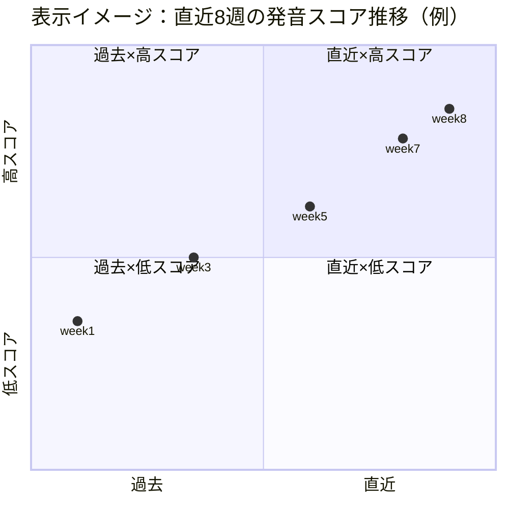
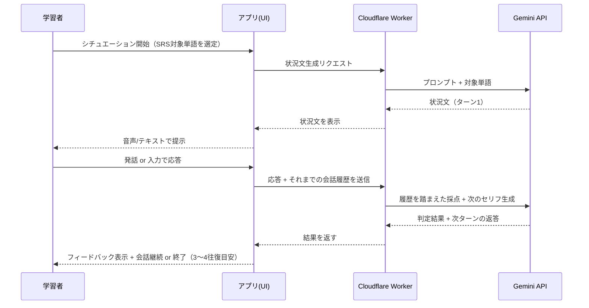

# 英語日記アプリ UI/UX改善提案書

**作成日**: 2026-07-16
**作成者**: UI/UXデザイン提案（ヒアリングベース）
**参考記事**: [UI/UXを学ぼう！英語アプリ比較してみた（Duolingo / AI英会話スピーク / mikan）](https://liginc.co.jp/657768)
**位置づけ**: 本書は `docs/要件定義書.md`（as-built）とは別の提案書です。実装済み仕様を変更するものではなく、第9章「将来要件」を具体化・拡張する検討資料です。

---

## 0. 要旨

参考記事は「ターゲットが明確な設計が、効果的な学習体験を生む」と結論づけています。本アプリはすでに**日記→自力英訳→単語調査→再英訳→AI添削→シャドーイング→発音チェック**という、他の英語学習アプリにはない独自の「書く・話す」アウトプット中心フローを持っています。課題は機能の不足ではなく、**その努力の積み重ねが目に見えない・楽しく感じられない**という体験面にあります。

ヒアリングで確認した2つの不満は次の通りです。

- 画面の見た目・操作感が地味／使いづらい
- 進捗や成長が実感しにくい

本書では、既存の実装（間隔反復・シチュエーション文練習など）を土台にしながら、この2点を解消する3つの提案と、ビジュアル刷新の方向性を示します。

---

## 1. ペルソナ

### 1.1 現行ペルソナ（今回の改善対象）

| 項目 | 内容 |
|---|---|
| 名前（仮） | はじめさん / 30代 |
| 状況 | 平日夜または通勤時間に英語日記を書いて学習を継続中 |
| ポジティブなニーズ | 「自分の言葉」で表現できるようになりたい。書いたことを実際に声に出して使えるようになりたい |
| ネガティブなニーズ | 毎日続けるモチベーションが切れやすい。今日の添削は見るが、1ヶ月前と比べて成長したかが分からない |
| 今のアプリへの評価 | 機能には満足しているが、画面を開いたときの「テンションの上がらなさ」と「積み上げの見えなさ」が継続の壁になっている |

### 1.2 将来ペルソナ（参考・今回はスコープ外）

ヒアリングで「将来的には語学学校向けの自習アプリ兼生徒管理アプリ」という構想が挙がりました。本書の提案は個人学習者向けの体験改善が中心ですが、以下の将来ペルソナを見据え、**そのまま拡張できる設計**（データはユーザー単位でRow Level Security済み、集計は既存テーブルのみで可能）であることを各提案内で明記します。

| ペルソナ | ニーズ |
|---|---|
| 語学学校の生徒 | 個人ペルソナと同じ体験に加えて、クラス内での自分の位置づけ（順位・比較）を知りたい |
| 教師・運営者 | 生徒ごとの学習継続率・弱点分野を俯瞰したい（管理ダッシュボード） |

---

## 2. 現状分析（As-Is）

参考記事のフレームワークに倣い、3アプリと現行アプリを同じ軸で比較します。

| 観点 | Duolingo | AI英会話スピーク | mikan | **本アプリ（現状）** |
|---|---|---|---|---|
| デザイントーン | 丸み・原色でポップ | シンプルで実用的 | 明るく機能的 | 落ち着いているが装飾が少なく単調 |
| 継続の仕組み | ストリーク・リーグ・キャラクター演出 | バッジ等軽め | 学習ログ中心 | **なし**（連続記録の算出・表示なし） |
| フィードバックの即時性 | 即時○×演出 | リアルタイム音声AIフィードバック | 即時正誤 | AI添削は数秒〜十数秒待ち、進行中表示はテキストのみ |
| 記憶定着の仕組み | 反復ドリル | 頻出表現ドリル | 間隔反復（学習科学ベース） | **間隔反復を実装済み**（F-11、エビングハウス曲線ベースのLeitner方式）だが、ユーザーからは「賢く出題されている」ことが見えづらい |
| 進捗の可視化 | レベル・XP・リーグ表示 | 学習時間ログ | 単語ごとの習得度 | 直近クイズのstreak表示のみ。日次の継続記録・カレンダー・統計はなし |

### 現状のUI/UX上の技術的な弱点（コード調査より）

- **エラー表示が`alert()`頼み**: 保存失敗・音声認識エラーなど約20箇所が標準の`alert()`ダイアログで、操作をブロックしデザインとも不統一（`app.js`各所）
- **ローディング表現が文字のみ**: 「AIが添削中…」等のテキスト差し込みのみで、スピナーや進捗の視覚表現がない
- **レスポンシブ対応が手薄**: メディアクエリが`max-width: 520px`の1箇所のみで、タブレットなど中間サイズの最適化がない
- **アクセシビリティ未対応**: `aria-*`属性が全画面で0件。ロック中カードやモーダルのフォーカス制御も未実装

これらは提案①〜③の「体験」を支える土台部分でもあるため、6章のビジュアル刷新と合わせて解消することを推奨します。

---

## 3. 提案① 進捗の可視化 — 要件定義書 R-01〜R-03 の具体化

「進捗が実感しにくい」という不満に最も直接効く提案です。幸い、必要なデータ（`entries.date`、`vocab`の正答数・SRSステージ）はすでに揃っており、**新しいテーブルを増やさずに実現可能**です。

### 3.1 ストリーク表示（R-01）

ヘッダー常設で連続日数を表示。「今日書けば記録が伸びる／途切れる」という損失回避の心理を使い、開くたびに継続への後押しをします。

```
┌─────────────────────────────────────┐
│  🔥 12日連続   最長記録: 21日          │  ← ヘッダー、全タブ共通
└─────────────────────────────────────┘
```

- 算出方法: `entries.date` を降順に走査し、今日 or 昨日から連続している日数をカウント（既存データのみで計算可能、バックエンド変更不要）
- 当日未執筆かつ夜になってきたら、炎アイコンが揺れる／色が薄くなるなど「消えかけている」演出で軽くリマインド（プッシュ通知は非対応環境のためUI内演出に留める）

### 3.2 学習カレンダー（R-02）

```
        7月
  日  月  火  水  木  金  土
              1   2   3   4
  5   6   7   8   9  10  11
 12  13  14  15● 16● 17  18
      ● = 日記を書いた日（タップで詳細へ）
```

過去の日記タブに「一覧」「カレンダー」の表示切替を追加。書いた日を塗りつぶし、タップで既存の日記詳細ページ（F-07-2）に遷移する導線は現状の画面遷移をそのまま流用できます。

### 3.3 統計ダッシュボード（R-03）

過去の日記タブ、または新設の「マイページ」的な位置に設置。

- 日記件数の推移（週次・月次）
- 単語帳登録数と正答率の推移
- 発音チェックの初回スコア推移（`pronunciation_first_attempt.score` は日記ごとに保存済み・F-06-6）— **「発音が上達している」ことを本人が実感できる、既存データだけで作れる強力な指標**
- カテゴリ別（文法／語彙／表現）フィードバックの指摘回数の推移 → 自分の弱点分野が視覚的に分かる



*(実装時は折れ線グラフで表現。上図は「右肩上がりに伸びていく」ことが一目で伝わる構成の例です)*

---

## 4. 提案② ゲーミフィケーション＋マスコットキャラクター「コトラ」

### 4.1 なぜ「猫」なのか

汎用的な動物キャラを取ってつけるのではなく、**このアプリ独自の学習メカニクスに紐づけたキャラクター**を提案します。

猫（特に子猫）は、獲物に忍び寄り、タイミングを見計らって飛びかかる「狩りの練習」を繰り返す習性を持ちます。これは本アプリの核である**シャドーイング（F-05・F-06：目標文を何度も繰り返し発話し、設定回数に到達して初めて発音チェックに進める仕組み）**と構造がそのまま重なります。またDuolingoのフクロウのような「賑やかに急かす」キャラクターは、日記という内省的な行為とはやや相性が悪く、猫の持つ「そばで静かに付き合う」距離感の方が本アプリのトーンに合います。

**マスコット名「コトラ」**（言葉のコト＋トラ猫のトラ）

| シーン | コトラの振る舞い | 対応する既存機能 |
|---|---|---|
| シャドーイング中（Step 6） | 目標文に向かって「忍び足」で近づくアニメーション。設定回数（Easy 10 / Normal 20 / Hard 50 回）に到達すると「キャッチ！」ポーズで発音チェックへ誘導 | F-02-3／F-06 のシャドーイング回数ゲートをそのまま演出化。既存のカウンター表示をコトラの動きに置き換えるだけで実装可能 |
| 単語を登録した時 | 新しい単語を「毛糸玉」として咥えてくる。単語帳タブに毛糸玉バスケットとして蓄積され、正答率が低い単語はくすんだ毛糸玉、定着した単語はきらきらした毛糸玉で表示 | F-08-2（単語自動追加）／F-09-3（正答率の色分け）の視覚的な言い換え |
| 日記保存が完了した時 | 香箱座り（お腹を丸めて座る、猫がリラックスしている時の姿勢）でしっぽをゆっくり揺らす | F-08 保存完了トーストの演出強化 |
| ストリークが伸びている時 | 伸びをして「今日も一緒に書こう」。書き忘れそうな時間帯は窓辺でこちらを見て待っている（催促ではなく「待っている」トーンに留める） | 3.1 ストリーク表示と連動 |
| レベルアップ時 | 首につけたリボン／鈴の色がブロンズ→シルバー→ゴールドと変化 | 4.2 のバッジ階層と統一されたビジュアル指標に |

成長段階は「子猫→若猫→貫禄のある大人猫」の3段階とし、見た目の変化とXP累計を連動させることで、**「自分が育てている」感覚とストリーク・語彙定着の実感を一致させます**。

### 4.2 XP・レベル・バッジ

| 仕組み | 内容 |
|---|---|
| XP獲得 | 日記1件保存、単語テスト1問正解、シチュエーション文練習成功などにXPを付与（既存の保存・正誤処理に加算ロジックを足すだけで実装可能） |
| レベル | XP累計に応じてコトラが成長し、首元のリボン／鈴の色が変わる。将来的な「語学学校」展開時はクラス内順位表示にも転用できる設計 |
| バッジ例 | 「7日連続」「単語100語登録（毛糸玉100個）」「発音スコア90%達成」「シチュエーション文練習10回成功」など。要件定義書のR-05（苦手単語モード）と組み合わせ「弱点克服バッジ」も設計可能 |

### 4.3 演出面の注意点

Duolingoほど賑やかにしすぎると「日記」という内省的な行為のトーンと衝突するため、**祝う演出は保存完了時・達成時に絞り、入力中の画面（Step 1〜5）は現状の落ち着いたトーンを維持**することを推奨します。猫という題材自体が「そばにいるが騒がない」距離感を持つため、この方針とも相性が良い選択です。

---

## 5. 提案③ AI機能の拡張

### 5.1 シチュエーション文練習 → 「AIロールプレイ会話」への拡張（Duolingo的要素）

現状のF-12は「AIが状況文を1つ提示 → 1回答えて終わり」の単発フローです。これを**複数ターンの会話**に拡張し、「AI英会話スピーク」に近い実践的な会話練習に発展させます。



- 既存のCloudflare Workerプロキシ・認証の仕組み（F-04-2）をそのまま再利用でき、新規インフラは不要
- 会話履歴をリクエストに含めるだけなので、既存のGemini呼び出し部分の拡張で対応可能
- 対象単語の使用判定・SRS更新（F-12-5）のロジックはそのまま維持し、「ターンを重ねるほど自然に使う機会が増える」設計にする

### 5.2 発音フィードバックのリアルタイム化（AI英会話スピーク的要素）

現状（F-06）は発話完了後にまとめてスコア・不一致単語・AIアドバイスを表示する「事後採点」型です。完全なリアルタイム音素解析はWeb Speech APIの制約上難しいため、現実的な改善として以下を提案します。

- 発話中、認識中の単語をリアルタイムで画面上にハイライト表示（`SpeechRecognition`の`interimResults`を活用し、確定前のテキストも逐次表示）
- 「聞き取れています」を示す簡易な音量メーター／波形アニメーションを表示し、無音のまま止まっている状態と発話中の状態を視覚的に区別
- 発話終了と同時に結果を表示するのではなく、「採点中…」の短いアニメーションを挟むことで、事後採点であることを隠さず、かつ淡白な瞬間表示にならないようにする

いずれもクライアント側（`app.js`の発音チェック処理）の拡張で完結し、バックエンド変更は不要です。

---

## 6. ビジュアルデザイン方向性

### 6.1 トーン

「学習アプリとしての落ち着き」を保ったまま、コトラが登場する場面（保存完了・達成演出）にポップさを集中させる、**メリハリ型**のトーンを提案します。全画面を常時賑やかにするのではなく、「頑張った瞬間だけ祝う」設計により、日記を書く内省的な行為の邪魔をしません。

### 6.2 配色の方向性

| 役割 | トーン | 使いどころ |
|---|---|---|
| ベース（背景・紙面） | 温かみのあるオフホワイト | 日記入力画面など、集中したい画面の背景 |
| プライマリアクセント（珊瑚〜オレンジ系） | エネルギッシュだが赤すぎない。コトラの毛色（トラ猫）にも通じる暖色 | CTAボタン、ストリークの炎、コトラのアクセントカラー |
| セカンダリアクセント（ティール系） | 落ち着いた寒色 | グラフ・統計、正解時のフィードバック |
| ハイライト（マリーゴールド系） | 黄金色 | XP・バッジ・レベルアップ演出、コトラの首のリボン |

現状の`style.css`は単色寄りの配色のため、上記3〜4色を役割ごとに固定して使い分けるだけでも「地味」という印象は大きく変わります。

### 6.3 形状・アニメーション方針

- カードの角丸を現状より大きくし（例: 8px→16px程度）、ステップカードやモーダルに統一
- 正解・保存完了などのポジティブなアクションに、既存の`showToast`を拡張したパルス／軽いバウンドアニメーションを追加（`prefers-reduced-motion`を尊重し、必要な人には抑制）
- `alert()`を廃止し、既存の`showToast`ベースのコンポーネントに統一（エラー・成功どちらも非ブロッキングに）

### 6.4 主要画面のBefore/Afterイメージ

```
[Before: 過去の日記タブ]        [After: 過去の日記タブ]
┌───────────────────┐        ┌───────────────────┐
│ 検索: [________]     │        │ 🔥12日連続  最長21日   │
│ 7/14 今日は...        │        │ [一覧] [カレンダー]    │
│ 7/13 週末に...        │        │ 検索: [________]     │
│ 7/12 会議で...        │        │ 7/14 今日は... 🧶+3   │
└───────────────────┘        │ 7/13 週末に... 🧶+2   │
                              └───────────────────┘
                              （🧶=その日記から追加された毛糸玉＝単語の数）
```

---

## 7. ロードマップ・優先順位

```mermaid
quadrantChart
    title 優先度 × 実装難易度
    x-axis 低難易度 --> 高難易度
    y-axis 低優先度 --> 高優先度
    quadrant-1 今すぐ着手
    quadrant-2 計画して着手
    quadrant-3 バックログ
    quadrant-4 スキマ時間で
    ストリーク表示(R-01): [0.15, 0.85]
    エラー表示のトースト統一: [0.2, 0.5]
    学習カレンダー(R-02): [0.35, 0.8]
    統計ダッシュボード(R-03): [0.5, 0.75]
    苦手単語モード(R-05): [0.3, 0.45]
    バッジ/XP: [0.55, 0.6]
    コトラ基本実装: [0.6, 0.55]
    発音フィードバックのリアルタイム化: [0.7, 0.4]
    AIロールプレイ会話拡張: [0.8, 0.5]
    アクセシビリティ改善: [0.4, 0.3]
```

### 要件定義書 第9章との対応

| 本書の提案 | 要件定義書との対応 | 優先度目安 |
|---|---|---|
| 3.1 ストリーク表示 | R-01 | 高（着手しやすく効果大） |
| 3.2 学習カレンダー | R-02 | 高 |
| 3.3 統計ダッシュボード | R-03 | 高 |
| 4章 ゲーミフィケーション・マスコット「コトラ」 | 新規提案（R-01〜03の上に乗せる演出層） | 中 |
| 5.1 AIロールプレイ会話 | F-12の拡張（新規提案） | 中〜低（会話設計・プロンプト調整に工数） |
| 5.2 発音フィードバックのリアルタイム化 | F-06の拡張（新規提案） | 中〜低 |
| R-05 苦手単語モード／R-06 過去日記からの復習出題 | 要件定義書に既存記載、本書では4.2バッジ設計と絡めて再掲 | 中 |

**推奨する着手順**: まず3章（進捗の可視化）と`alert()`廃止などの土台整備を行い、「進捗が見える」状態を先に作った上で、4章（コトラ・ゲーミフィケーション）→5章（AI機能拡張）の順で発展させるのが、既存の落ち着いたコードベース（ビルド工程なしのVanilla JS）への影響を抑えつつ効果を早く得られる進め方です。

---

## 8. まとめ

- 現状の最大の課題は機能不足ではなく、**積み重ねた努力が「見えない」「祝われない」こと**
- 必要なデータ（日記の日付、単語の正答率・SRSステージ、初回発音スコア）はすでに蓄積されており、**新規テーブルなしで進捗可視化（3章）を実装できる**
- マスコット「コトラ」は装飾ではなく、シャドーイングという本アプリ独自の学習メカニクス（狙って→繰り返して→仕留める）から着想した、**この製品にしか成立しないキャラクター**として設計。猫の「そばで静かに付き合う」距離感は、日記という内省的な行為のトーンとも自然に噛み合う
- AIロールプレイ会話・発音フィードバックのリアルタイム化は、既存のCloudflare Worker／Gemini連携をそのまま再利用でき、新規インフラなしで発展可能
- 将来の「語学学校向け生徒管理アプリ」構想とも矛盾しない設計（ユーザー単位のデータ分離はRLSで既に確保済み）
